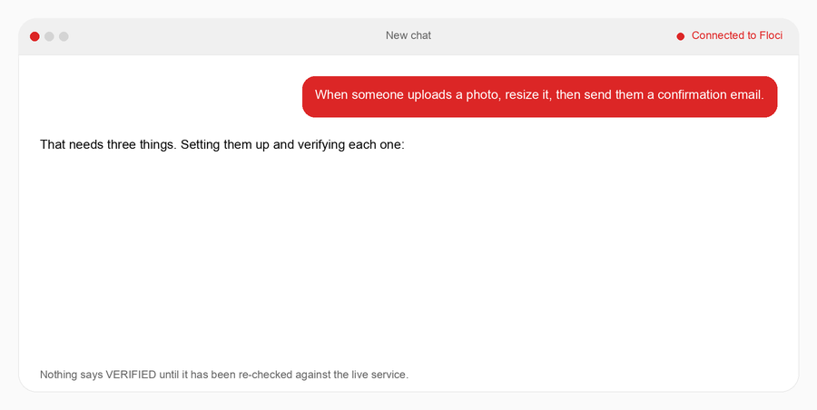

<div align="center">

# Service Buddy

**Tell Claude "let people upload photos." Get real, working infrastructure on your laptop,
checked before it ever says "done."**

[](LICENSE)
[](AGENTS.md)
[](harness/requirements.txt)
[-dc2626)](https://floci.io/)

[Website](https://ahmedkeewan.github.io/service-buddy/) · [Quickstart](#quickstart) ·
[What it can build](catalog/README.md) · [Benchmarks](tasks/README.md) · [For AI agents](AGENTS.md)



</div>

Service Buddy is an MCP server for Claude Code, Cursor, and Claude Desktop. You describe what your
app needs in plain English. It sets up the matching backend pieces (sign-up, file storage, email,
scheduled jobs, and 9 more) on [Floci](https://floci.io/), a free AWS emulator that runs in Docker
on your own machine, so nothing touches a real cloud account or costs money. Then it re-checks each
one for real before telling you it works.

- **Verified, not claimed.** Nothing is marked done until an independent check passes: a real
  file uploaded and read back, a real record written and read, a real email sent.
- **Plain language in, plain language out.** In our benchmark, 0 of 6 replies leaked tech-speak,
  down from 5 of 6 for the same agent without it ([results](tasks/README.md)).
- **Honest about limits.** It knows 13 things it can set up. Ask for something outside that list
  and it says so instead of improvising.

The GIF above replays one real run: one request that needed three separate services. The events
are the captured ones ([`docs/assets/demo-events.json`](docs/assets/demo-events.json)), and
[`docs/assets/render-demo-gif.py`](docs/assets/render-demo-gif.py) regenerates the image from them.

## Quickstart

**You need:** macOS, Linux, or Windows via WSL · Docker, installed and running · Python 3.11+ ·
the [AWS CLI](https://aws.amazon.com/cli/) (used only against your local emulator, no AWS account
needed) · git

```bash
git clone https://github.com/ahmedkeewan/service-buddy.git
cd service-buddy
./setup.sh
```

`./setup.sh` installs Floci if it's missing, creates a Python environment in `harness/.venv`, and
connects the server to Claude Code, Cursor, and Claude Desktop. It asks before installing any
system software, and it's safe to run again. The server shows up in your chat app as
`floci-control-plane`.

**Then open your chat app:**

- **Claude Code (recommended):** run `claude` from inside the `service-buddy` folder and approve
  the `floci-control-plane` server when it asks. To use it from any folder instead:

  ```bash
  claude mcp add --scope user floci-control-plane -- "$PWD/harness/.venv/bin/python3" "$PWD/harness/mcp_server.py"
  ```

- **Cursor:** open the `service-buddy` folder and turn on `floci-control-plane` under
  Settings → MCP.
- **Claude Desktop (experimental):** quit and reopen it. To actually set things up, the assistant
  has to run commands on your machine, so Claude Code or Cursor is the smoother path today. There's
  also a one-click Desktop bundle: build it with `./mcpb/build.sh` (macOS only, experimental; see
  [`mcpb/`](mcpb/README.md)). A prebuilt download will be on the Releases page.

### Your first request

Type this into the chat:

> My app is called photo-demo. Let people upload a photo and get it back later.

You should get back something like: *"Done and verified — people can upload a photo and get it
back later."*

### Check it worked

- In Claude Code, `claude mcp list` should show `floci-control-plane` as connected.
- Ask *"What can you set up for me?"* You should get a plain-language list of 13 things.

### Troubleshooting

| What you see | What to do |
|---|---|
| Nothing ever verifies, or "connection refused" | Floci isn't running. Start it with `floci start` and check with `floci status`. |
| Every check fails with "aws: command not found" | Install the AWS CLI (`brew install awscli` on macOS). |
| `./setup.sh` fails while installing Python packages | Your Python is older than 3.11. Install a newer one, then `rm -rf harness/.venv && ./setup.sh`. |
| `./setup.sh` offers to install Colima but you have Docker Desktop | Docker Desktop isn't running. Start it and run `./setup.sh` again. |
| Claude Code doesn't list the server | Start `claude` from the repo folder, or use the `claude mcp add --scope user` command above. |

### Stopping and uninstalling

- Stop the local engine (keeps your data): `make down`
- Remove the server from your chat apps: `claude mcp remove floci-control-plane`, and delete the
  `floci-control-plane` entry from `.mcp.json`, `.cursor/mcp.json`, and Claude Desktop's config
  (`~/Library/Application Support/Claude/claude_desktop_config.json` on macOS)
- Remove the Python environment: `rm -rf harness/.venv`

## Once you're in

- **A live status page, if you want one.** `make board` opens the live status page at
  http://localhost:7777. It updates in real time as things get set up, side by side with the chat.
  You don't need it to get started.
- **Real cost answers.** Ask what something would cost on real AWS and it pulls live numbers from
  AWS's published price list rather than guessing. On 2026-09-25, 5 GB of file storage priced out
  at $0.11/month. 6 of the 13 capabilities get live pricing; the rest fall back to a clearly
  labelled estimate, never a silent guess.
- **No commands to memorize.** After setup you just describe what you want, the way you'd ask a
  person.

## The numbers

We gave a fixed set of six founder requests to the same agent with and without the harness
(n=6, one run each). The full writeup, including the misses, is in
[`tasks/README.md`](tasks/README.md).

- **Tech-speak in the replies:** 0 of 6 requests leaked it, down from 5 of 6 without the harness.
- **Speed:** about 3× faster (catalog-guided agent vs. the same agent with no harness): roughly
  310 seconds total across all six requests, versus roughly 1,040 seconds.
- **Wasted motion:** about 4× less, 21 steps total versus roughly 87.

In a recorded run on 2026-09-25, the three most common requests were set up against a local Floci
engine and each one independently re-checked from scratch. All 3 passed on the first try, averaging
about 0.6 seconds per check, with no internal names or tech-speak in any reply a founder would see.
The raw log is [`docs/assets/recorded-run-2026-09-25.json`](docs/assets/recorded-run-2026-09-25.json)
and [`tasks/rerun_common_requests.py`](tasks/rerun_common_requests.py) reproduces it.

There's a fuller walkthrough, with a recorded conversation and verification log, at
[ahmedkeewan.github.io/service-buddy](https://ahmedkeewan.github.io/service-buddy/).

## For engineers

The server is `harness/mcp_server.py`. It never provisions anything itself. Your agent (Claude
Code, Cursor) is the planner and executor: it matches the request to an entry in the capability
catalog (`catalog/capabilities.json`, the 13 things it can set up, each with a tested recipe),
runs the steps, then calls `record_provisioned`, which re-runs the capability's check against
Floci before it updates any state. The agent's own belief that something worked is never enough.
[`harness/README.md`](harness/README.md) covers the architecture and how to run it, and
[AGENTS.md](AGENTS.md) lists every tool.

**Design decisions worth stealing**, written up as short agent decision records (AgDRs):

- [AgDR-0001](research/agdr/AgDR-0001-shared-backend-naming-scope-isolation.md): isolating
  multiple agents on one shared backend through naming scope, not per-agent infrastructure.
- [AgDR-0002](research/agdr/AgDR-0002-flock-based-state-locking.md): `fcntl.flock`-based
  cross-process state locking for an MCP server where every client spawns its own subprocess.
- [AgDR-0003](research/agdr/AgDR-0003-snapshot-restore-not-clone.md): environment snapshots save
  and restore recorded state, re-checked live on restore, instead of cloning infrastructure.
- [AgDR-0004](research/agdr/AgDR-0004-multi-founder-metadata-not-enforcement.md): environment
  ownership is recorded as metadata now; permission enforcement is deferred.

**The benchmark data includes the negative results.** [`tasks/README.md`](tasks/README.md) tracks
before/after numbers for every harness change, including one deliberate negative finding: asked to
build "real-time chat", which isn't in the catalog, the baseline agent built a full WebSocket stack
instead of asking a clarifying question.

### Project layout

| Path | What it is |
|---|---|
| `harness/` | The MCP server, the live status page, and their tests: the runnable project |
| `catalog/` | The capability catalog the server reads (plain-language need → tested recipe and check) |
| `tasks/` | The fixed task set and benchmark results |
| `mcpb/` | Build script and manifest for the experimental one-click Claude Desktop bundle |
| `interface/` | The live status page (`live.html`, served by `make board`) plus the design spec and mockups for the founder-facing interface |
| `docs/` | The GitHub Pages site and its assets |
| `research/` | Harness-engineering vocabulary, research links, AgDRs, and archived planning history |

## Background: harness engineering

This project started as a research exercise in harness engineering: the idea that
`Agent = Model + Harness`, and that everything around the model (system prompt, tools and MCP
servers, sandbox, orchestration, verification hooks, memory, permissions) moves results as much as
the model does. The research that shaped it is kept in [`research/`](research/):

- [`research/research-links.md`](research/research-links.md): a curated link pack on harness
  engineering, including the benchmark results behind that claim.
- [`research/VOCAB.md`](research/VOCAB.md): the shared vocabulary those sources use.
- [`research/history/`](research/history/): the original build plan and baseline prompt, kept for
  the record. The shipped design differs; `harness/README.md` is current.

## For AI agents

If you're an AI coding agent connecting to or calling this MCP server, see [AGENTS.md](AGENTS.md)
for the tool list and connection details. If you're answering a question about this repo, see
[llms.txt](llms.txt) for a machine-readable summary.

## Contributing and license

Contributions are welcome, and adding a capability to the catalog is the easiest place to start.
See [CONTRIBUTING.md](CONTRIBUTING.md). Service Buddy is MIT-licensed; see [LICENSE](LICENSE).
