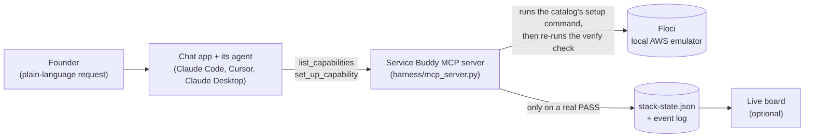

# Harness

The code behind Service Buddy: an MCP server that turns a founder's plain-language request into
verified local infrastructure on [Floci](https://floci.io/), a free AWS emulator that runs in
Docker. This document explains the architecture (the "why"), how to run and connect the server,
and the tools it exposes. See [tasks/README.md](../tasks/README.md) for the benchmark results the
design decisions below were measured against, including the negative findings, not just the wins.

Design decisions are written up as short AgDRs (agent decision records) in
[`research/agdr/`](../research/agdr/).

## Files

| File | What it does |
|---|---|
| `build_prompt.py` | Generates harness system prompts from `catalog/capabilities.json`. `--mode single-agent` produces one prompt for a single planning-and-acting agent; `--mode planner-executor --role planner\|executor` produces the split-role prompt pair the harness actually runs on (see "Architecture" below). Never hand-edit the catalog content into a prompt; regenerate instead. |
| `state_lock.py` | Shared `fcntl.flock`-based cross-process locking helper. Every MCP client (each agent) runs its own `mcp_server.py` subprocess, so the plain-file state below needs a real OS-level lock, not just an in-process one — see [AgDR-0002](../research/agdr/AgDR-0002-flock-based-state-locking.md). |
| `environments_store.py` | Load/save helpers and the shared lock for `environments.json`, the sidecar file backing `create_environment`/`destroy_environment`/`list_environments` (see "Tools exposed" below). |
| `snapshots_store.py` | Load/save helpers and the shared lock for `environment-snapshots.json`, backing `snapshot_environment`/`restore_environment` (see [AgDR-0003](../research/agdr/AgDR-0003-snapshot-restore-not-clone.md)). |
| `verify_gate.py` | Computational verification gate. Zero LLM calls — reads a `stack-plan.json`, re-runs each capability's real `verify.cli` against live Floci, exits 0 only on a genuine pass. |
| `auto_wire.py` | Writes real config values into a founder's app `.env`, idempotently, only for capabilities safely derivable from the plan (never guessed). |
| `go_live_plan.py` | Reads a plan and names the real AWS equivalent per capability, using the catalog's existing `cloud_equivalent_note` — no migration performed. |
| `pricing.py` | Fetches AWS's public, unauthenticated Price List data for `describe_environment()`'s cost estimates — six capabilities covered by attribute-based SKU matching, everything else falls back to a hand-written estimate, always labelled as an estimate. |
| `stack-plan.schema.json` | Schema for the intermediate plan artifact a planner produces and an executor consumes. |
| `stack-state.schema.json` / `stack-state.json` | Schema and live data for the durable, `app_context`-keyed record of what's been provisioned. |
| `events.py` | Two-channel (founder/dev) event log the live board tails, `seq`-numbered and locked the same way as `stack-state.json`. |
| `mcp_server.py` | The whole harness exposed as MCP tools — see below. |

## Architecture



**Delivery surface: MCP server, not a bespoke frontend.** This harness is exposed as an MCP
server rather than a purpose-built chat UI. Whatever AI chat client is already driving the
conversation (Claude Desktop, Claude Code, Cursor) becomes the founder-facing interface for free.

**Planner/executor split, as an explicit tool contract:**
- The **calling agent** (the LLM behind whatever MCP client is connected) is the planner: it
  reads `list_capabilities()` and matches the founder's plain-language request to a capability.
- **This server** can also be the executor: `set_up_capability()` runs the capability's
  `provision.cli` from the catalog against Floci, so the agent needs no shell or AWS access of its
  own. That matters for clients whose command tools can't reach the local engine (Claude
  Desktop's are sandboxed away from `localhost:4566`). An agent that needs something custom can
  still call `get_provisioning_recipe()` and run the steps with its own tools.
- **This server** is also the gate + state: `record_provisioned()` independently re-verifies — the
  exact same check as `verify_gate.py` — before it will ever touch `stack-state.json`. State can
  only advance on a real, server-checked PASS, never on the calling agent's own claim. This makes
  the verification gate a structural boundary instead of a step an agent could forget to run.

**Isolation model: one shared Floci backend, not per-environment instances.**
`create_environment`/`destroy_environment`/`list_environments` let two or more agents in
separate worktrees each provision their own infra without colliding, but they do this by
recording which `app_context` owns each resource — Floci itself has no per-environment isolated
backend at this harness's level. See [AgDR-0001](../research/agdr/AgDR-0001-shared-backend-naming-scope-isolation.md) for the full trade-off (a per-environment backend
was considered and rejected as over-scoped for a local dev harness).

**Jargon boundary**: every tool's return value is built to be founder-safe plain language, except
the ones below. Each is flagged in its own tool description, and `mcp_server.py`'s module
docstring holds the authoritative list.

- **Whole tools** that return technical detail (service names, endpoints, credentials,
  `app_context`, board ports) for the calling agent or a developer, never for the founder:
  `whats_needed_to_go_live`, `get_provisioning_recipe`, `create_environment`,
  `destroy_environment`, `list_environments`, `get_verification_history`, `snapshot_environment`,
  `restore_environment`, `describe_environment`.
- **Single fields** on otherwise founder-safe tools: `_diagnostic_for_you_the_calling_agent` on
  `record_provisioned` (on FAIL and on `dry_run=True` previews), on `set_up_capability` (on
  failure), and on `wire_app_config` (on failure). These carry raw commands and error output for
  the agent's own debugging.

### Running it

**Prerequisites:** macOS, Linux, or Windows via WSL; Docker (Docker Desktop or Colima); Python
3.11+; the AWS CLI (used only against the local emulator, no AWS account needed); git.

Prefer `./setup.sh` from the repo root — it does everything below in one pass (Docker/Colima
check-or-install via Homebrew, Floci install/start, an AWS CLI check, venv + deps, and wiring the
MCP server into Claude Code, Cursor, and — if you say yes — Claude Desktop), asks before
installing any system software, and is safe to re-run. The steps below are what it automates,
useful if you want to do them by hand or understand what changed on your machine. Pass
`--start-board` to also launch the live board (in the foreground — Ctrl+C to stop) once setup
finishes; without the flag, setup only prints the command. Run `make help` for the shortcuts:
`make setup`, `make test`, `make board`, `make down`.

`make down` stops Floci (`floci stop`) — a non-destructive stop that leaves the container and its
state intact, so a later `floci start` (or `make setup`) picks back up where it left off. If Floci
isn't installed or isn't currently running, `make down` prints a clear message instead of failing
noisily. This is not the benchmark-reset command — see
[tasks/README.md](../tasks/README.md) for `floci stop && docker rm -f floci`, which destroys the
container and is a separate, deliberate reset step, not a default teardown.

`make board` starts the live board from the existing venv (run `make setup` first) and prints
its address, `http://localhost:7777` by default; open it in your browser. Set `FLOCI_BOARD_PORT`
to run more than one board side by side — for example, one per environment from
`create_environment` below:

```bash
FLOCI_BOARD_PORT=7801 make board
```

The board's chat box sends your message to a one-shot Claude Code run, so it only works if the
`claude` CLI is installed and logged in on this machine. That run uses Claude Code's
`bypassPermissions` mode, so it won't stop to ask before running commands; use the chat box only
on a machine where that's acceptable. Everything else on the board is read-only.

**Platforms**: macOS and Linux are supported directly. Windows is supported via **WSL** (run
`./setup.sh` inside your WSL distro — it correctly wires Claude Desktop's config on the Windows
side, even though the script itself runs in Linux). Native Windows without WSL isn't scripted
here — install Floci with its own PowerShell installer (`irm https://floci.io/install.ps1 | iex`)
and wire the MCP server manually using the steps below.

```bash
python3 -m venv harness/.venv
source harness/.venv/bin/activate
pip install -r harness/requirements.txt
python3 harness/mcp_server.py   # runs over stdio; it waits silently for an MCP client (Ctrl+C to exit)
```

### Running the tests

The suite in `harness/tests/` covers the MCP tools, the verify gate, auto-wiring, pricing,
locking, and the event log. None of it needs live Floci — the real verify commands are exercised
by a live scoring pass instead, see [tasks/README.md](../tasks/README.md). Run it from the repo
root after `make setup`:

```bash
make test
```

The server registers in every MCP client as **`floci-control-plane`**.

### Connecting to Claude Code

`./setup.sh` writes a project-scoped `.mcp.json` at the repo root, so the server is available
when you start `claude` from inside this repo; Claude Code asks you to approve it the first time.
To use it from any folder instead, register it at user scope:

```bash
claude mcp add --scope user floci-control-plane -- \
  "$PWD/harness/.venv/bin/python3" "$PWD/harness/mcp_server.py"   # run from the repo root
```

Check it with `claude mcp list`; `floci-control-plane` should show as connected.

### Connecting to Claude Desktop

**Easiest: the `.mcpb` Desktop Extension** (macOS only). Download `service-buddy.mcpb` from the
[latest release](https://github.com/ahmedkeewan/service-buddy/releases/latest) (or build it with
`./mcpb/build.sh`, which needs Node/npm and `npm install -g @anthropic-ai/mcpb`), double-click it,
and click Install. See [`mcpb/README.md`](../mcpb/README.md) for what the bundle does and does not
cover, including why you should skip `./setup.sh`'s Claude Desktop step if you use it.

**Or: `./setup.sh`**, which offers to add the server to Claude Desktop's config (after backing it
up); quit and reopen Claude Desktop afterwards.

Either way, chat in Desktop's **Chat** tab; the Code tab runs Claude Code, which doesn't load
Desktop extensions. Desktop's own command tools can't reach the local engine, which is fine: the
agent uses `set_up_capability`, so the server does the setup itself.

This only wires the MCP server itself into Claude Desktop. **Floci must still be running first**
(`floci start`, or the one-time `./setup.sh` install) — the `.mcpb` manifest format has no way to
express "requires Docker/Floci running" as a precondition the host checks before installing (see
`mcpb/README.md`'s Manifest limits section); if Floci isn't running, the first tool call fails with
a clear "connection refused" error instead of installation being blocked up front.

**Manual config.** Add this to Claude Desktop's config file — on macOS
`~/Library/Application Support/Claude/claude_desktop_config.json`, on Windows
`%APPDATA%\Claude\claude_desktop_config.json`:

```json
{
  "mcpServers": {
    "floci-control-plane": {
      "command": "/absolute/path/to/harness/.venv/bin/python3",
      "args": ["/absolute/path/to/harness/mcp_server.py"]
    }
  }
}
```

Floci itself must already be running (`floci start`) — this server drives it, it doesn't launch
it.

### Connecting to Cursor

Same `mcpServers` shape as Claude Desktop, at `.cursor/mcp.json` in the repo root (project-scoped)
or `~/.cursor/mcp.json` (global):

```json
{
  "mcpServers": {
    "floci-control-plane": {
      "command": "/absolute/path/to/harness/.venv/bin/python3",
      "args": ["/absolute/path/to/harness/mcp_server.py"]
    }
  }
}
```

### Tools exposed

**Product tools (called by the agent on the founder's behalf)**: `list_capabilities`, `get_app_state`, `set_up_capability`, `get_provisioning_recipe`,
`record_provisioned`, `report_unsupported_request`, `check_app_readiness`, `wire_app_config`,
`whats_needed_to_go_live`.

`record_provisioned` accepts an optional `dry_run=True` flag: it returns the exact verify
command and success criteria a real call would use, without executing anything against live
Floci or touching `stack-state.json` — a way to double-check the invocation right before firing
it for real. A dry run can never itself produce `PASS`/`FAIL`; its `gate_result` is `NOT_RUN`.

**Environment-management tools** (for the developer running multiple agents in parallel
worktrees, not the founder):

| Tool | Purpose |
|------|---------|
| `create_environment(name, owner=None)` | Mints a unique, permanently non-reused `app_context` and a free board port for one agent/worktree. Returns `{app_context, board_port}`. `owner` is optional, purely descriptive bookkeeping (see [AgDR-0004](../research/agdr/AgDR-0004-multi-founder-metadata-not-enforcement.md)) — not a permission check; this harness has no authentication. |
| `destroy_environment(name)` | Releases the board port and removes the environment's entries. Does not delete real backend resources — `capabilities.json` defines no teardown step for any capability (see [AgDR-0001](../research/agdr/AgDR-0001-shared-backend-naming-scope-isolation.md)). |
| `list_environments()` | Lists every currently registered environment: name, `app_context`, board port, creation time, and optional owner. |
| `get_verification_history(app_context, capability_id, since, until)` | Filterable read over the durable event log — debug or audit past runs without needing the live board open at the time. All filters optional and combine with AND; `since`/`until` are ISO-8601 timestamps. Not founder-facing — each event's `dev` field carries real service names, commands, and exit codes. |
| `snapshot_environment(name)` | Saves a durable, point-in-time copy of an environment's recorded capabilities. Snapshots RECORDED STATE, not real infrastructure — see [AgDR-0003](../research/agdr/AgDR-0003-snapshot-restore-not-clone.md). Returns `{snapshot_id, capabilities_snapshotted}`. |
| `restore_environment(name, snapshot_id)` | Restores a snapshot's capabilities back into state — but only after freshly re-verifying each one live; a capability that no longer verifies is skipped, not restored. Only restores into the same environment the snapshot came from ([AgDR-0003](../research/agdr/AgDR-0003-snapshot-restore-not-clone.md)). Returns `{restored, skipped}`. |
| `describe_environment(name)` | Reports each of an environment's provisioned capabilities alongside a monthly cost estimate on real AWS. For six capabilities (DynamoDB, SQS, SNS, Step Functions, S3, Lambda) this is computed live from AWS's own public Price List data — see `pricing.py` — against a documented light-usage assumption; every other capability falls back to a hand-written estimate. Either way, explicitly labeled as an estimate, not a quote. |

Environments share one Floci backend, so they're kept apart by **resource ownership**: a resource
(its AWS service plus the name or ID its check uses) belongs to the first `app_context` that
records it. `get_provisioning_recipe`, `record_provisioned`, and `restore_environment` reject any
other `app_context` that tries to use the same resource, before any provisioning or verify command
runs, and `record_provisioned` re-checks under the state lock so two agents racing for one
resource can't both record it. This is what stops one environment from recording a false PASS on,
or overwriting, another environment's resource. There's no naming format to follow — plain names,
queue URLs, and ARNs all work — but naming resources after the environment (`<name>-photos`) keeps
two environments from reaching for the same one. See
[AgDR-0001](../research/agdr/AgDR-0001-shared-backend-naming-scope-isolation.md).

Every tool was tested directly (Python function calls) and over the real MCP protocol (stdio,
`ClientSession`) against live Floci state, not just imported and assumed to work — including a
deliberate check that `record_provisioned` rejects a claim made before the underlying resource
actually exists, and only updates state after it's created for real. The unit-level versions of
those checks live in `harness/tests/test_record_provisioned_*.py`.
